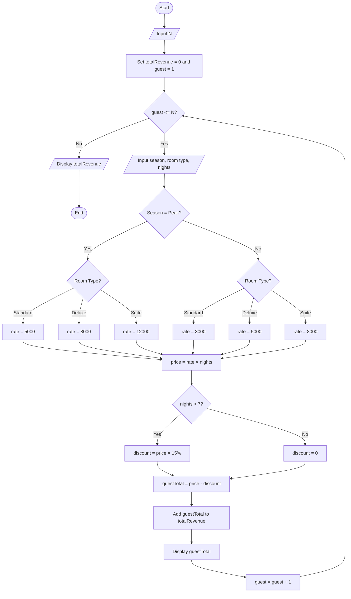
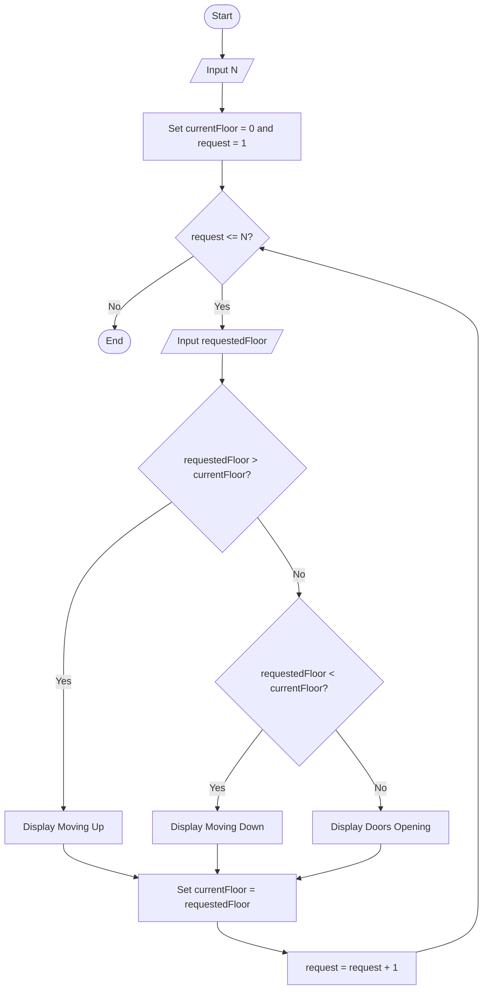
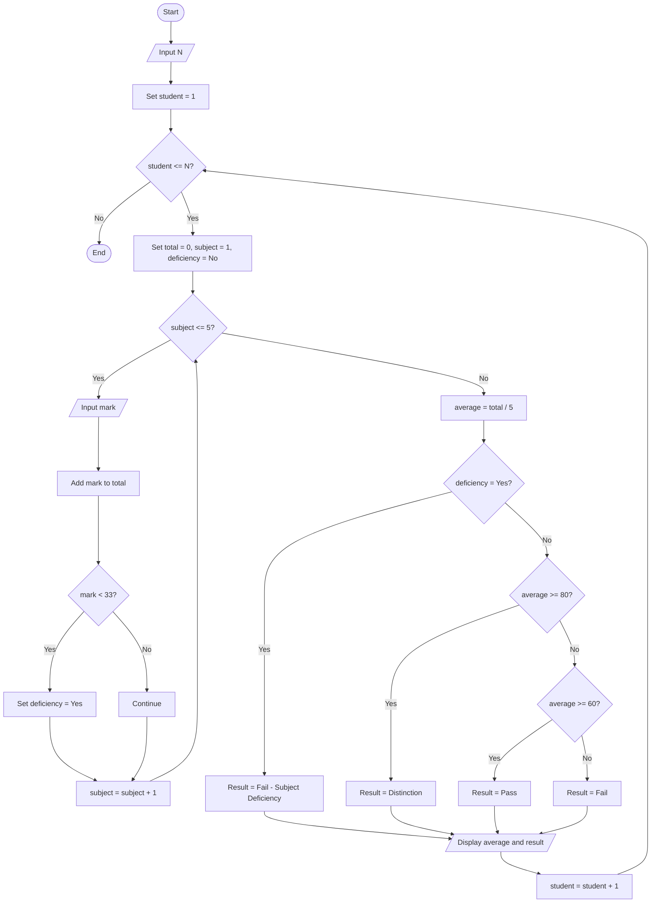
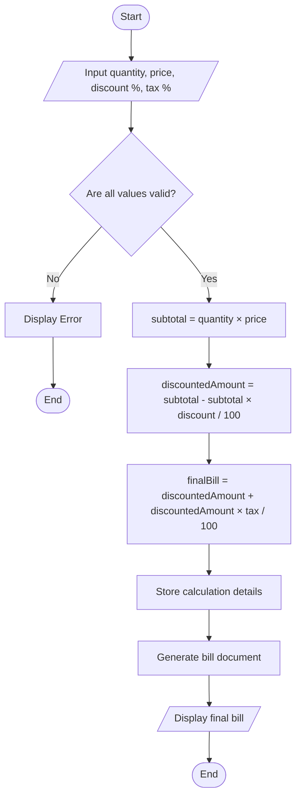
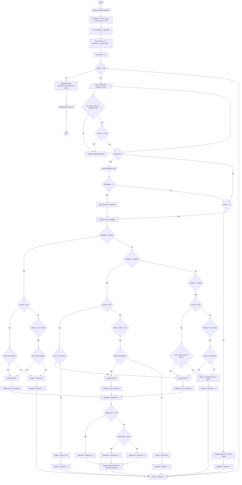
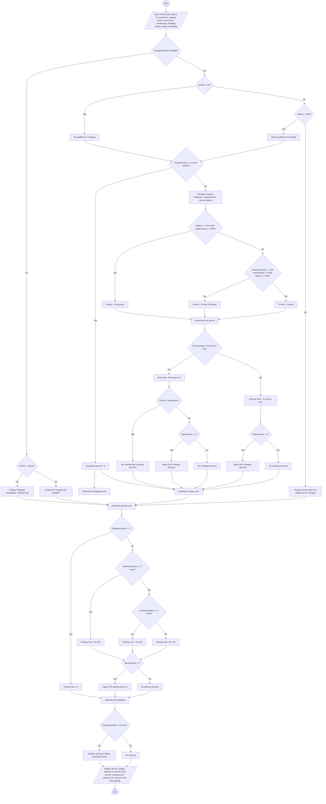

## Section B — IPO Charts, PAC Charts & Flowcharts

> **Note:** The PAC charts below use the standard structure of **Problem, Inputs, Processing/Logic, and Outputs** because the assignment PDF does not prescribe a specific PAC template.

---

# Question 1 — Hotel Booking System

## IPO Chart

| Input                             | Processing                                         | Output              |
| --------------------------------- | -------------------------------------------------- | ------------------- |
| Number of guests (N)              | Repeat for each guest                              | Guest's total price |
| Season (Peak/Off-Peak)            | Select room rate according to season and room type | Discount amount     |
| Room type (Standard/Deluxe/Suite) | Calculate rate × nights                            | Total revenue       |
| Number of nights                  | If nights > 7, apply 15% discount                  |                     |
|                                   | Add each guest's total to total revenue            |                     |

## PAC Chart

| Problem                                      | Inputs                       | Processing / Logic                                                                                               | Outputs                             |
| -------------------------------------------- | ---------------------------- | ---------------------------------------------------------------------------------------------------------------- | ----------------------------------- |
| Calculate hotel booking charges for N guests | N, season, room type, nights | Select rate based on season and room type; calculate price; apply 15% discount if nights > 7; accumulate revenue | Guest total price and total revenue |

## Flowchart

---

# Question 2 — Elevator Simulation

## IPO Chart

| Input                  | Processing                                 | Output        |
| ---------------------- | ------------------------------------------ | ------------- |
| Number of requests (N) | Start current floor at 0                   | Moving Up     |
| Requested floor        | Compare requested floor with current floor | Moving Down   |
|                        | Update current floor after every request   | Doors Opening |

## PAC Chart

| Problem                                           | Inputs             | Processing / Logic                                                                   | Outputs                           |
| ------------------------------------------------- | ------------------ | ------------------------------------------------------------------------------------ | --------------------------------- |
| Simulate an elevator responding to floor requests | N, requested floor | Compare requested floor with current floor; determine movement; update current floor | Movement message for each request |

## Flowchart

---

# Question 3 — Class Result Processing

## IPO Chart

| Input                    | Processing                                                 | Output                           |
| ------------------------ | ---------------------------------------------------------- | -------------------------------- |
| Number of students (N)   | Input 5 subject marks for each student                     | Average                          |
| 5 marks for each student | Calculate total and average                                | Distinction                      |
|                          | Check whether any mark is below 33                         | Pass                             |
|                          | Classify based on average unless subject deficiency exists | Fail / Fail — Subject Deficiency |

## PAC Chart

| Problem                        | Inputs                    | Processing / Logic                                              | Outputs                     |
| ------------------------------ | ------------------------- | --------------------------------------------------------------- | --------------------------- |
| Process results for N students | N and 5 marks per student | Calculate average; check for any mark below 33; classify result | Average and result category |

## Flowchart

---

# Question 4 — Online Shopping Bill Calculator

## IPO Chart

| Input               | Processing                            | Output            |
| ------------------- | ------------------------------------- | ----------------- |
| Quantity            | Calculate subtotal = quantity × price | Subtotal          |
| Price per item      | Apply discount                        | Discounted amount |
| Discount percentage | Apply tax                             | Final bill        |
| Tax percentage      | Validate all entered values           | Bill document     |

## PAC Chart

| Problem                           | Inputs                             | Processing / Logic                                                    | Outputs                            |
| --------------------------------- | ---------------------------------- | --------------------------------------------------------------------- | ---------------------------------- |
| Calculate an online shopping bill | Quantity, price, discount %, tax % | Validate inputs; calculate subtotal; discount amount; tax; final bill | Calculation details and final bill |

## Flowchart

> **Assumption for the validation flowchart:** quantity must be positive, price must not be negative, and discount/tax percentages must be valid percentages.

---

# Question 5 — Smart Campus Parking and Access Management System

## IPO Chart

| Input                             | Processing                    | Output                |
| --------------------------------- | ----------------------------- | --------------------- |
| Number of expected vehicles       | Validate vehicle information  | Assigned zone         |
| Vehicle type: Car/Bike/Van        | Check permit and category     | Remaining capacity    |
| Category: Faculty/Student/Visitor | Apply eligibility rules       | Accepted/Rejected     |
| Permit: Y/N                       | Check zone capacity           | Reason for rejection  |
| Emergency: Y/N when required      | Update occupancy and counters | Final parking summary |

## PAC Chart

| Problem                          | Inputs                                                               | Processing / Logic                                                                                    | Outputs                                                                               |
| -------------------------------- | -------------------------------------------------------------------- | ----------------------------------------------------------------------------------------------------- | ------------------------------------------------------------------------------------- |
| Manage campus parking and access | Number of vehicles, vehicle type, category, permit, emergency status | Validate data; determine eligibility; check zone capacity; assign zone; update counters and occupancy | Accepted/rejected vehicles, assigned zones, occupancy, remaining capacity and summary |

## Flowchart

---

# Question 6 — Smart EV Charging and Parking Management System

## IPO Chart

| Input                         | Processing                          | Output               |
| ----------------------------- | ----------------------------------- | -------------------- |
| Vehicle type: EV/Hybrid       | Check charging station availability | Vehicle type         |
| Current battery SOC           | Determine charging eligibility      | Charging priority    |
| Required charging level       | Calculate required charging         | Peak/Off-Peak status |
| Parking duration              | Determine charging rate             | Charging cost        |
| Current time                  | Calculate parking cost              | Parking cost         |
| Membership                    | Apply membership discounts          | Discount             |
| Disabled priority             | Apply parking rules                 | Final payable amount |
| Charging station availability | Display warnings/messages           | Warning/message      |

## PAC Chart

| Problem                                | Inputs                                                                                                           | Processing / Logic                                                                                                                          | Outputs                                                                              |
| -------------------------------------- | ---------------------------------------------------------------------------------------------------------------- | ------------------------------------------------------------------------------------------------------------------------------------------- | ------------------------------------------------------------------------------------ |
| Manage EV charging and parking charges | Vehicle type, battery %, required %, parking duration, time, membership, disabled priority, station availability | Check charging eligibility; calculate charging requirement and priority; determine peak/off-peak rate; calculate parking cost and discounts | Charging priority, charging cost, parking cost, discount, final payable and messages |

## Flowchart

---

## End of Section B Charts
